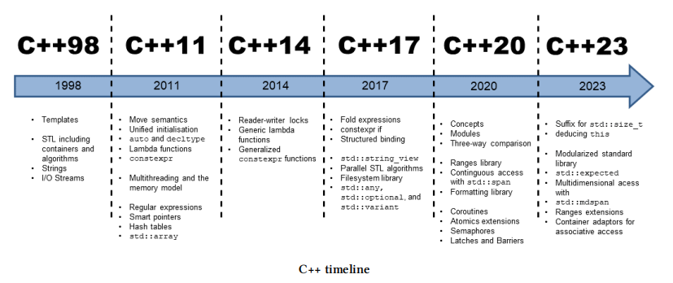

# The C++ standard Library

## 概述

C++ 标准的发展进程如图：



C++ 的标准库有很多方法库：

1. 移动（move）、交换（swap）

2. `std::bind, std::bind_front`从已有的函数创建新的函数；可以使用`std::function`将函数绑定到变量上面，后续使用

3. 匹配对（`std::pair`）和元组`std::tuple`

4. 变量的引用包装器`std::ref, std::cref`

5. **智能指针**，自动管理内存，`std::shared_ptr, std::unique_ptr, std::weak_ptr`，对于引用计数就可能存在循环引用的问题，所以这里需要`std::weak_ptr`来解决这个问题。

6. 使用`type_traits`方式可以在编译期获取和操作类型信息

7. 时间库，对于C++多线程能力是一个重要的附加

8. `std::any`任何个数变量，`std::optional`可选预定变量，`std::variant` 可变值

9. `std::vector`可变数组擅长将新元素放到最后，`std::queue`擅长将新元素放在开头

10. `std::list`用作双向链表，`std::forward_list`用作单向链表

11. 有序关联容器`std::set`, `std::map`, `std::multiset`, `std::multimap`，访问元素时间复杂度是$O(log(n))$

12. 无序关联容器`std::unordered_set`, `std::unordered_map`, `std::unordered_multiset`, `std::unordered_multimap`，访问元素时间复杂度是$O(1)$，**std::unordered_map** 是在 **95%** 的情况下的选择。

13. 容器适配器有一个简单操作相关容器的接口，`std::stack`, `std::queue`, `std::priority_queue`

14. 数值相关的，随机数库和数学计算函数库

15. 字符串`std::string`, `std::string_view`拷贝高效，只是指向实际`std::string`对象的引用

16. 正则表达式

17. I/O 库，格式化库，文件系统库，处理目录，硬链接，符号链接和普通文件

18. 多线程，原子变量，线程，锁，条件变量和信号量


对于库的使用，在源码中通过`#include <xxxx>`引入库文件，基本上统一在`std`命名空间中，注意在头文件中不要使用`using namespace std;` 这样会让命名空间`std`所有名称可见。


常用的命令行编译命令`g++ -std=c++14 thread.cpp -o thread -pthread`

`-pthread` 参数的作用是确保在链接阶段包含 pthread 库，以便使用多线程编程，用来启用对 POSIX 线程库（POSIX Threads，简称 pthread）的支持。


## 常用工具

**安全比较**，即有符号负数与无符号整数比较，会发生整数类型提升和类型转换，有符号负数会转换为较大的无符号整数。另外，安全比较的目的也包括避免溢出（上溢或者下溢）。

```c++
#include <utility>
-1 > 0u; // true
std::cmp_greater(-1, 0u); // false
```


