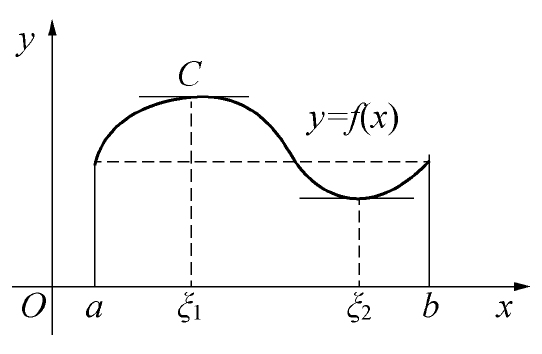
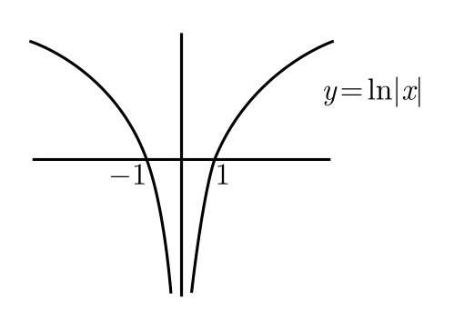
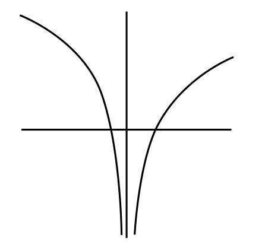
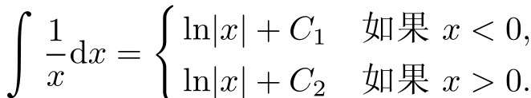
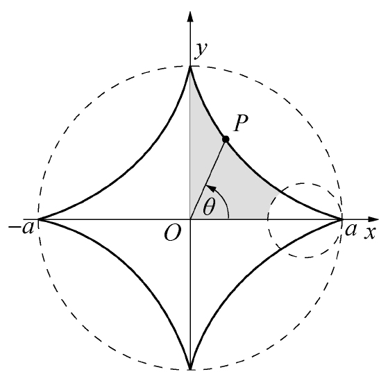

# 高等数学（同济）

## 常用函数

| 函数名称   | 表达式                   | 说明                                                         |
| ---------- | ------------------------ | ------------------------------------------------------------ |
| 幂函数     | $y = x^a$                | a 是常数                                                     |
| 指数函数   | $y=a^x, (a>0, a \neq 1)$ | a > 1单调递增；0 < a < 1单调递减                             |
| 对数函数   | $y=log_ax(a>0, a\neq 1)$ | a > 1单调递增；0 < a < 1单独递减； a = e 时，自然对数 $y = lnx$ 定义域$(0, +\infty)$ |
|            | 对数函数运算性质         | ① $log_ax + log_ay=log_ax\cdot y$                            |
|            |                          | ② $log_ax-log_ay=log_a{\frac {x}{y}}$                        |
|            |                          | ③ $log_ax^b=b\cdot log_ax$                                   |
|            |                          | ④ $y=log_ax 和 y=a^x互为反函数$， 它们图像关于 $y=x$ 对称 |
| 三角函数   | $y = \sin(x)$            | 正弦，定义域 $R$，值域$[-1,1]$                               |
|            | $y = \cos(x)$            | 余弦，定义域 $R$，值域$[-1,1]$                               |
|            | $y=\tan(x)$              | 正切 $\{x \mid x \neq \frac{\pi}{2} + k\pi, k=0, \pm 1,\ ...\}$ 值域 $(-\infty, +\infty)$ |
|            | $y = \cot(x)$            | 余切  定义域 $\{x \mid x \neq  k\pi, k=0, \pm 1, \pm2,...\}$ |
|            | $y=sec(x)$               | 正割  $y =sec(x) = \frac {1}{cos(x)}$                     |
|            | $y=csc(x)$               | 余割 $y=csc(x)=\frac{1}{sin(x)}$                          |
| 反三角函数 | $y=arcsin(x)$            | 反正弦函数，定义域$[-1, 1]$，值域$[-\frac{\pi}{2}, \frac{\pi}{2}]$ |
|            | $y=arccos(x)$            | 反余弦函数，定义域$[-1, 1]$，值域 $[0, \pi]$                 |
|            | $y=arctan(x)$            | 反正切函数，定义域$(-\infty, +\infty)$，值域$(-\frac{\pi}{2}, \frac{\pi}{2})$ |
|            | $y=arccot(x)$            | 反余切函数，定义域$(-\infty, +\infty)$，值域 $(0, \pi)$      |
| 常函数     | $y=C$                    | 定义域$(-\infty, +\infty)$，值域 $C$                         |
| 绝对值函数 | $y=\mid x\mid$           | 定义域$(-\infty, +\infty)$，值域$[0, +\infty)$               |
| 符号函数   | $y=sgn(x)$               | 定义域$(-\infty, +\infty)$，值域$(-\infty, +\infty)$         |
| 取整函数   | $y=[x]$                  | 不超过 x 的最大整数称为 x 的整数部分，定义域$(-\infty, +\infty)$，值域整数集 $Z$ |

## 极限

自然数 $e$
$$
\lim\limits_{h \to 0+}(1+h)^{\frac 1h} = e
$$

## 导数

| 原函数$f(x)$ | 导函数$f^{'}(x)$           | 说明                          |
| ------------ | -------------------------- | ----------------------------- |
| $C$          | $0$                        | 常函数                        |
| $x^n$        | $n\cdot x^{n-1}$           |                               |
| $sin(x)$     | $cos(x)$                   |                               |
| $cos(x)$     | $-sin(x)$                  |                               |
| $a^x$        | $a^x\cdot lna$             | 特别的$e^x的导数是 e^x$       |
| $log_a(x)$   | $\frac 1{x\cdot lna}$      | 特别的 $lnx的导数是 \frac 1x$ |
| $tan(x)$     | $sec^2(x)$                 |                               |
| $cot(x)$     | $-csc^2(x)$                |                               |
| $sec(x)$     | $sec(x) \cdot tan(x)$      |                               |
| $csc(x)$     | $-csc(x) \cdot cot(x)$     |                               |
| $arcsin(x)$  | $\frac 1{\sqrt{1 - x^2}}$  |                               |
| $arccos(x)$  | $-\frac 1{\sqrt{1 - x^2}}$ |                               |
| $arctan(x)$  | $\frac 1 {1+x^2}$          |                               |
| $arccot(x)$  | $-\frac 1 {1+x^2}$         |                               |

- $1+tan^2x=sec^2 x$
- 

### 求导

1. $若函数f(x)在x_0处可导，则函数f(x)在x_0处连续。[连续是可导的必要条件]$**函数连续未必可导!!!**，可导是函数连续的充分条件。
2. 导数的和、差、积、商
	1. $(u(x) \pm v(x))^{'} = u^{'}(x)\pm v^{'}(x)$
	2.  $(u(x) \cdot v(x))^{'} = u^{'}(x)v(x) + u(x)v^{'}(x)$
$$
(\frac uv)^{'} = \frac {u^{'}\cdot v - u \cdot v^{'}}{v^2}
$$
3. 反函数的导数等于直接函数$(y)$导数的倒数．
$$
(arcsin(x))^{'} = \frac 1{(sin(y))^{'}} = \frac 1{cos(y)} = \frac {1}{\sqrt{1 - sin^2(y)}} = \frac1{\sqrt{1 -x^2}}
$$

复合函数求导

$$
\frac{dy}{dx}  = \frac {dy}{du} \cdot \frac {du}{dx}，即 y^{'}(x) = f^{'}(u) \cdot g^{'}(x)
$$

对于函数 $f(x) = x^{\frac 1x}(x > 0, x \ne 1)$，有 $f^{'}(x) = (e^{\frac {lnx}{x}})^{'}$

极限与导数
$$
f^{'}(h) = \lim\limits_{x \to h}\frac {f(x)-f(h)}{x - h}
$$

特别的若 $f(0)=0$
$$
\lim\limits_{x \to 0} \frac {f(x)}{x} = f^{'}(0)
$$

参数方程
$$
\begin{equation}
y = y(x)=\left\{
\begin{aligned}
x & = \arctan(t) \\
y & = ln(1 + t^2) \\
\end{aligned}
\right.
\end{equation}
$$
求导
$$
\frac {dy}{dx} = \frac {\frac{dy}{dt}}{\frac {dx}{dt}} \\
\frac {d^2 y}{dx^2} = \frac {d}{dx}(\frac {dy}{dx}) = \frac {\frac{d}{dt}(\frac{dy}{dx})}{\frac {dx}{dt}}
$$

曲率

1. $y = f(x)$

$$
K = |\frac {d\alpha}{ds}| = \frac {|y^{''}|}{(1+y^{'2})^{\frac 32}}
$$

2. 参数方程 $x = \varphi(x); y = \psi(x)$

$$
K = \frac {\varphi^{'}(t)\psi^{''}(t) - \varphi^{''}(t)\psi^{'}(t)|}{[\varphi^{'2}(t) + \psi^{'2}(t)]^{\frac 32}}
$$

## 等价无穷小

| 表达式                                           | 等价无穷小               | 说明  |
| ------------------------------------------------ | ------------------------ | ----- |
| $ln(1+x)$                                        | $x$                      | 备注1 |
| $e^x - 1$                                        | $x$                      | 备注2 |
| $x - ln(1+x)$                                    | $\frac {1}{2} \cdot x^2$ | 备注1 |
| $1-cosx$                                         | $\frac {1}{2}\cdot x^2$  | 备注3 |
| $(1 +x)^a-1$                                     | $ax$                     | 备注4 |
| $acrsinx, sinx, arctanx, tanx$                   | $x$                      |       |
| $\lim\limits_{x \to 0}\frac {arcsinx + sinx}{x}$ | $2$                      |       |

备注：

1. $ln(1+x)$ 麦克劳林公式

$$
ln(1+x) = x - \frac {x^2}{2} + \frac {x^3}{3} -\ ...\ +(-1)^{n-1}\cdot\frac {x^n}{n} + o(x^n)
$$

2. $e^x$ 麦克劳林公式

$$
e^x = 1 + x + \frac {x^2}{2!} + \ ...\ +\frac {x^n}{n!}+\frac {e^{\theta x}}{(n+1)!} \cdot x^{n+1};\  0 < \theta < 1
$$

3. $cosx$ 麦克劳林公式

$$
cosx = 1- \frac{x^2}{2!} + \frac{x^4}{4!}-\frac{x^6}{6!}+\ ...\ +(-1)^n \frac{x^{2n}}{2n!} + \frac{cos[\theta x + (n+1)\pi]}{(2n+2)}x^{2n+2}
$$

4. $(1+x)^a$ 的麦克劳林公式

$$
(1+x)^a = 1 + ax + \frac {a(a-1)}{2!} \cdot x^2 + \ ...\ + \frac {a(a-1) \cdot \ ...\ \cdot (a -n+1)}{n!} \cdot x^n + o(x^{n+1}) \ (a \in R)
$$

5. $sinx$ 的麦克劳林公式

$$
sinx=x - \frac{x^3}{3!} + \frac {x^5}{5!} -\ ...\ + (-1)^{n-1} \cdot \frac{x^{2n-1}}{(2n-1)!} +\frac {sin[\theta x + (2n+1)\frac {\pi}{2}]}{2n+1}! \cdot x^{2n+1}
$$

## 积分求解

$\int_0^1 cos^2xdx = \int_0^1 \frac {1+cos2x}{2}dx$

极限和积分
$$
\lim\limits_{n \to \infty}\ \frac 1n \cdot \sum_{i=1}^{n}\ ln(1+\frac{i^2}{n^2}) = \int_{0}^{1}ln(1+x^2)dx
$$

分部积分法
$$
\int_0^1\ ln(1+x^2) dx = x\cdot ln(1+x^2) - \int_0^1\ x \cdot \frac {2x}{1+x^2}\ dx
$$

$$
\int udv = uv - \int vdu
$$

## 常用公式

| 名称           | 详情                                             |      |
| -------------- | ------------------------------------------------ | ---- |
| 立方和         | $a^3 + b^3=(a+b)\cdot (a^2 - ab + b^2)$          |      |
| 立方差         | $a^3-b^3=(a-b)\cdot(a^2+ab+b^2)$                 |      |
| 二项式         | $(a+b)^n=\sum_{r=0}^{n}C_n^r a^{n-r}b^r$         |      |
| 正切，正割关系 | $sec^2(x) = 1 + tan^2(x)$                        |      |
| 平方累积和     | $1^2 + 2^2 +\ ...\ +n^2=\frac {n(n+1)(2n+1)}{6}$ |      |
| 不等式         | $\sqrt{x \cdot y} \le \frac{x + y}{2}$           |      |
|                |                                                  |      |

备注：

1. 平方累积和 

$$
(n+1)^3 - n^3 = 3 \cdot n^2 + 3 \cdot n + 1 \\
n^3 - (n-1)^3 = 3\cdot (n-1)^2+3 \cdot (n-1)+1\\
... \\
3^3 - 2^3=3\cdot 2^2 + 3 \cdot 2 + 1 \\
2^3 - 1^3=3\cdot 1^2 + 3 \cdot 1 + 1
$$

各项求和即可，再求解平方累积和部分结果。

## 定理

### 费马定理

设函数 $f(x)$ 在点 $x_0$ 的某个邻域 $U(x_0)$ 内有定义并且在 $x_0$ 处可导，对任意的 $x \in U(x_0)$，恒有 $f(x) \le f(x_0)$ （或 $f(x) \ge f(x_0)$ ），那么 $f^{'}(x_0)=0$.

### 罗尔定理

函数 $y=f(x)$ 满足：

1. 在闭区间 $[a, b]$ 上连续
2. 在开区间 $(a, b)$ 内可导
3. 在区间端点处的函数值相等，即 $f(a) = f(b)$​

那么在 $(a, b)$ 内至少有一点 $\xi(a < \xi < b)$ ，使函数 $y=f(x)$  在该点处的导数等于 0，$f^{'}(\xi) = 0$.

**三个条件充分非必要**，罗尔定理可以作为普通函数和导函数的纽带。

### 零点定理

1. 若函数 $f(x)$ 在 $[a, b]$ 上连续
2. $f(a) \cdot f(b) < 0$ 

则至少存在一点 $\xi \in (a, b)$，使 $f(\xi) = 0$

### 介值定理

1. 若函数 $f(x)$ 在 $[a, b]$ 上连续
2. $f(a) = A, \ f(b) = B\ (A \ne B)$

则对于 $A, B$ 之间的任何一个数 $C$， 在 $(a, b)$ 内至少存在一点 $\xi$，使 $f(\xi) = C$。函数必然取的介于最小值 $m$ 和最大值 $M$ 之间的任何值。

### 拉格朗日中值定理

如果函数 $f(x)$ 满足，

1. 在闭区间 $[a, b]$ 上连续
2. 在开区间 $(a, b)$ 内可导
3. 则至少存在一点 $\xi \in (a, b)$，使 

$$
f^{'}(\xi) = \frac {f(b)-f(a)}{b -a}，即 f(b) - f(a) = f^{'}(\xi)\cdot (b-a)
$$

### 柯西中值定理

设函数 $f(x), F(x)$ 满足

1. 在 $[a, b]$ 上连续
2. 在 $(a, b)$ 内可导
3. 当 $x \in (a, b)$ 时， $F^{'}(x) \ne 0$，

则至少存在一点 $\xi \in (a, b)$ ，使得
$$
\frac {f(b) - f(a)}{F(b) - F(a)} = \frac {f^{'}(\xi)}{F^{'}(\xi)}
$$

## 性质

### 极限的保号性

1. 单调保号：如果函数 $f(x)$ 在某区间内是单调递增或单调递减的，并且在该区间内有极限 $L$，则该极限 $L$​ 也继承该单调性。
2. 正负保号：如果函数 $f(x)$ 在某区间内的值始终为正或为负，并且在该区间内有极限  $L$，则该极限  $L$ 也继承该符号性质。

## 实例

### 数列极限

题目：设 $a_1>0, a_{n+1}=ln(1+a_n)(n = 1, 2, ...)$，证明 $\lim\limits_{n \to \infty} a_n$ 存在，并求此极限

解：证明：

- 因为 $a_1 > 0$，设 $a_k > 0$，则 $a_{k+1} = ln(1+a_k) > 0$，由数学归纳法可知，对任意的 $n$，有 $a_n>0$
- 因为 $x>0$ 时，$ln(1+x) < x$，所以 $a_{n+1} = ln(1+a_n)<a_n$，所以 $\{a_n\}$ 单调递减，且 $\{a_n\}$ 均大于 0，有下界，故 $\lim\limits_{n \to \infty}a_n$ 存在
- 令 $\lim\limits_{n \to \infty} = A$，对 $a_{n+1} = ln(1+a_n)$ 两边同时取极限得 $A=ln(1+A)$，解得 $A=0$

### 可导性

$f(x)=x^{\frac 23}$ 在 $x=0$ 处不可导

- $f(0) = 0$

- $\lim\limits_{h \to 0} \frac {f(0+h)-f(0)}{h} = \lim\limits_{h \to 0} \frac {h^{\frac 23}}{h}=\lim\limits_{h \to 0} h^{-\frac{1}{3}}=\infty$​
- 故不可导

### 判断题

1. 若 $f(x)$ 在 $x=a$ 处可导，且 $f(a) \ne 0$，则 $|f(x)|$ 在 $x=a$ 处一定可导

- 设 $f(x) > 0$ ，因为 $\lim\limits_{x \to a}f(x) = f(a)$，故存在 $\delta > 0$，当 $x \in (a-\delta, a+\delta)$ 时
- $f(x) > 0$，则 $\lim\limits_{x \to a}\frac {|f(x)|-|f(a)|}{x - a}=\lim\limits_{x \to a} \frac {f(x) - f(a)}{x-a}=f^{'}(a)$
- 即 $|f(x)|$ 在 $x=a$ 处可导，同理 $f(a) < 0, |f(x)|$ 在 $x=a$ 处可导。

### 证明题

> 拉格朗日中值定理

1. 若 $0 < b \le a, 则 \frac {a-b}{a} \le \ln(\frac ab) \lt \frac {a-b}{b}$

证明：设$f(x)=\ln x$ 在区间 $[b,a]$满足条件，又 $b< \xi <a$

注意：

$\int \frac1xdx = ln|x| + C$ 并不正确，

将右边上移 $\frac12$，函数形式并非 $\ln|x|+C$ 了

$\int_0^{\frac {\pi}{2}}f(cosx) = \int_0^{\frac {\pi}{2}}f(sinx)$

面积微元 $dS = \frac 12 \cdot [r(\theta)]^2d\theta$ ，扇形面积为
$$
S = \frac 12 \int_\alpha^\beta [r(\theta)]^2d\theta
$$
绕 $x$ 轴的旋转体体积
$$
V_x = \pi \int_a^bf^2(x)dx
$$
绕 $y$ 轴的旋转体体积
$$
V_y = 2\pi \int_a^b x\cdot f(x)dx
$$

椭圆 $\frac {x^2}{a^2} + \frac {y^2}{b^2}=1$，绕 $x$ 轴旋转体积 $V = \frac 43 \pi ab^2$，绕 $y$ 轴旋转体积 $V=\frac 43 \pi a^2 b$，特别的 $a=b=R$，即球体的体积公式为 $V=\frac 43\pi R^3$

弧长
$$
s = \int_a^b \sqrt{1+f^{'2}(x)}dx
$$
参数方程弧长公式
$$
ds = \sqrt{\varphi^{'2}(x) + \psi^{'2}(x)} dt
$$
星形线
$$
\left\{
\begin{aligned}
x = acos^3t \\
y = asin^3t
\end{aligned}
\right.
$$

## 微分方程

可分离变量的微分方程
$$
\frac {dy}{g(y)} = f(x)dx
$$
齐次方程
$$
\frac {dy}{dx} = \varphi(\frac yx)
$$
令 $u=\frac yx$,有
$$
u + x \cdot \frac {dy} {dx} = \varphi(u)
$$
应用分离变量即可。

一阶线性微分方程
$$
\frac {dy}{dx} + P(x) \cdot y = Q(x)
$$
当 $Q(x) \equiv 0$ 时，下面方程为一阶齐次线性微分方程
$$
\frac {dy}{dx} + P(x) \cdot y = 0
$$
一阶齐次线性微分方程的通解为
$$
y=C\cdot e^{-\int P(x)dx}
$$
一阶线性微分方程通解，设为
$$
y = u(x) \cdot e^{-\int P(x)dx}
$$
求导
$$
y^{'} = u^{'}(x)\cdot e^{-\int P(x)dx} - u(x)\cdot P(x) \cdot e^{-\int P(x)dx}
$$
将 $y^{'}$ 代入一阶线性微分方程
$$
u^{'}(x) = Q(x) \cdot e^{\int P(x)dx}
$$
积分可得 $u(x)$
$$
u(x) = \int Q(x) \cdot e^{\int P(x)dx} +C
$$
代入一阶线性微分方程通解
$$
y = [\int Q(x) \cdot e^{\int P(x)dx}dx + C] \cdot e^{-\int P(x)dx}
$$
